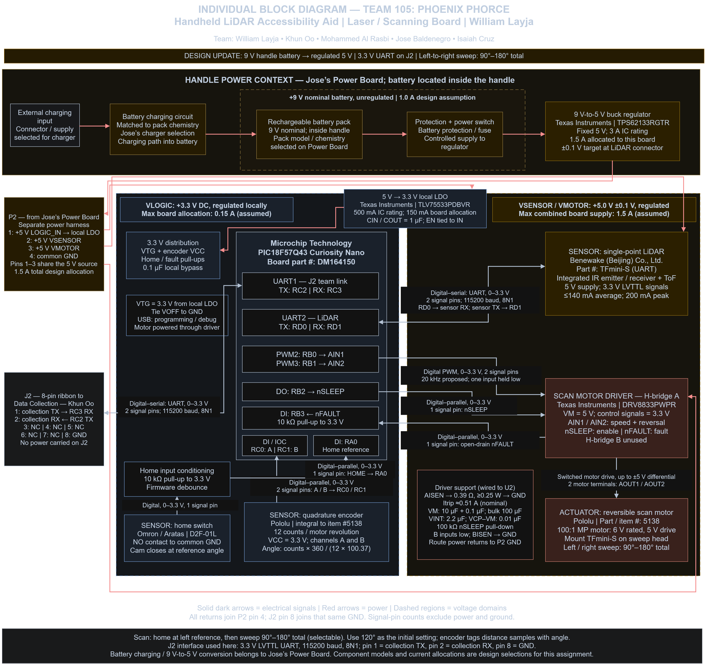
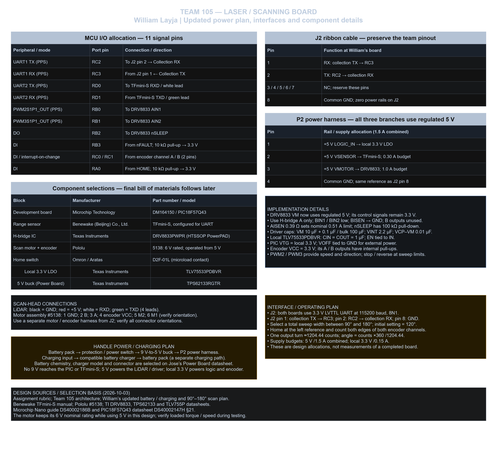

## Individual Block Diagram

**Team:** 105 — Phoenix Phorce  
**Project:** Handheld LiDAR Accessibility Aid  
**Member:** William Layja  
**Subsystem:** Laser / Scanning Board

## Overview

My subsystem measures obstacle distance and controls the
left-to-right motion of the LiDAR sensor. A PIC18F57Q43
Curiosity Nano communicates with the TFmini-S sensor and
controls the scan motor through a DRV8833 motor driver.
An encoder tracks rotation, and a home switch establishes
the starting reference position. The planned total sweep
is between 90 and 180 degrees.

The battery is located inside the handle. The Power Board
provides battery charging and converts the nominal 9 V
battery supply to regulated 5 V. A local regulator supplies
3.3 V to the controller and encoder. The scanning board
communicates with the Data Collection Board through J2
using 3.3 V UART signals.

## Block Diagram

**Figure 1:** Laser / scanning subsystem, power connections,
microcontroller peripherals, and signal interfaces.

## Pin Assignments and Component Details

**Figure 2:** Component selections, connector pinouts,
supporting circuitry, and operating plan.

## Design Assumptions

Current allocations are design assumptions for this assignment.
The final bill of materials will be developed afterward.
Battery and charging components will be selected as part
of the Power Board design.